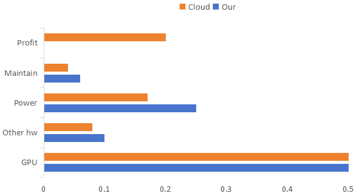

# 李沐 SJTU 讲座总结

## 第 1 部分：语言模型

语言模型可以分为三部分，分别是算力、数据、算法。语言模型和机器学习模型本质就是把数据通过算力和算法压到模型中，使得模型具有一定的识别和泛化能力。

李沐老师比喻机器学习是老中医，深度学习和语言模型是炼丹。数据就是炼丹需要的材料，算力就是丹炉，算法就是丹方。

深度学习和语言模型的区别就是机器学习针对特定领域问题进行优化，而语言模型具有跨领域的广泛适应性。

### 硬件

重要程度依次递减

1. 带宽

     目前语言模型规模较大，一个机器无法解决，需要采用分布式训练。评级在带宽上，

* 从400Gb过渡到800Gb（Infiniband以太网）

     > 目前每根光纤的速度是 400 Gb。

* GB200 72NVL有72个GPU，每个GPU的速度为1.8TB/s（130TB/s）(delay)

     > 由于供电、散热等问题，一个机架位只能放两台机器。GB200 72NVL 把 72 块 GPU 压到一个机架位里，散热使用水冷。使得每块 GPU 之间更近，GPU 之间使用光纤进行数据传输，虽然光速很快 ( 约 0.3m / ns )，但几纳秒的延迟在分布式训练中依然会有可见的性能影响。

     发展趋势：单核 -> 多核 -> 多卡 -> 集成多卡

* PCle 类似（但速度慢得多）
     
     > GPU 和 CPU 之间的 PCle 每几年也会翻倍，但速度慢一些
   
2. 内存

     由于模型很大，需要很多内存。

* 2倍内存（192GB/芯片），2倍带宽（HBM3e）

     > 目前的工艺每个芯片封装 192GB 内存，已经达到瓶颈。原因是内存占面积，一个芯片的大小是固定的，内存面积无法太大。后面几年如果有工艺突破，则可以做到更大内存，否则可能每块芯片就限制在 200GB 左右。如果没有工艺突破，模型大小就会受限，所以内存大小决定了模型上限。

* NVIDIA紧随AMD Mi300之后

     > NVIDIA 在内存上不如 AMD，甚至不如当年 Google 的 TPU。

3. 算力

    摩尔定律，纳米级别更高，频率更高

* 一半的位分辨率（FP4、FP8 E4M3和E5M2），两倍的速度

     > 8 位浮点数已经非常成熟。4 位浮点数占的硬件变小，带宽利用率变高。

* 吞吐量的两倍（B200上为4.5 TF FP8，H10O上为2 TF FP8）

     > 最近几代 NVIDIA 芯片都降低了浮点数精度。
  
4. 资源

* 芯片尺寸的两倍，1kW/芯片，可能需要液体冷却

     > 当更大规模时，供电等资源是很大的问题 (想做个电厂出来，做电厂的成本比付电费的成本低)。一千块芯片需要一兆瓦。

* 市场愿意支付的任何价格

     > 充分竞争的市场算力翻倍，价格不变。但由于 NVIDIA 的垄断，算力翻倍，导致价格 1.4 倍的提升。但长期来看，随着市场竞争的加剧，算力会更加便宜。

5. 替代方案

* 谷歌TPUv6（万亿）、英特尔哈瓦那3、AMD Mi350、Azure Maia 100

     > 其他芯片做推理可以，但是做训练不太行。

### 模型 

摩尔定律，训练模型每年会价格减半或时间减半或模型大小翻倍。

1. 语言

* 10-50T tokens 预训练（10T+ tokens 现已开源）
        
     > 这个数量级已经发展差不多了，应该不会再多了。因为目前人类历史上数据很多，但考虑到多样性、数据质量。10-50T 规模就差不多。

* 100-500B参数开源（Llama 3 405B）

     > 比较好的一线模型尺寸在 100-500B, 超过 500B 可以训练，但做生理很难。Google 和 OpenAI 的所有模型换算成稠密模型有效大小应该都没超过 500B。MoE 不算。因此，在未来几年，因为内存和数据的限制，100-500B 将是一个主流大小。闭源可以做的更大，但可能是用 MoE 做的，所有有效大小也就是 500B 左右。

* 2-5T参数闭源（GPT4为2T MoE）

2. 演讲和语音

* 端到端模型（更高的准确性、情感）

     > 情绪、语调、方言等等都包含在语音中，语言模型能发掘里这些信息，而输出就可以根据输入的情绪等场景变化音调。

* 更低的延迟（对呼叫中心和实时对话有用）

     > 以前是 1s 延迟，现在能做到 300ms，可以打断人的发言，这样人与机器交流的体验就会很好。

* 其他

     > 通过语言模型用文本定制一个声音

3. 音乐生成

* 不是技术问题，而是版权问题（不是RIAA/MPAA的问题）

     > 现在已经开始逐渐解决版权问题，大公司直接买版权，小公司就..。通过音乐生成，就可以用音乐表达情感，类似与表情符号等。

4. 图片

* 分辨率提升超过1MP

* 生成具有“灵魂”的图像
  
     > 现在生成的图片和真的图片很像，但仍然缺少“灵魂”。

5. 视频

* SORA、Imagen等。目前训练相当昂贵

     > 视频数据非常难弄。生成一张图片容易，生成视频难点在于连续帧之间的图片一致性。

6. 多模态

* 结合多种输入/输出模式的趋势（序列骨干加令牌是当前的范式）

     > 文本数据的信息含量是最高的，且获取相对容易。利用在文本数据上学习的能力，泛化到不同的模块(图片、视频等)。能够利用文本定制声音、图片、视频等。

7. 总结

> 目前语言模型在 80-85 分。音频 70-80 分。视频 50 分。

> 人机交互会逐渐改变。

### 应用

1. 提供无限的人力资源
   
2. 艺术专业白领：用自然语言跟人和世界打交道

     这点语言模型做的很好，文科白领 1 小时的工作内容可以用语言模型直接获得 80%-90%。

* 个人助理

* 电话客服

* 文件处理

* 游戏和娱乐

* 教育

3. 工科白领：输出代码，问题解决方案

     目前语言模型想取代工科还不太现实，但能够帮助节省工作量。

* 软件工程

4. 蓝领：了解世界，输出行动
   
     这点是语言模型最难实现的。

* 自动驾驶汽车（自动驾驶正在从CNN升级到Transformers）

     > 这是蓝领方面语言模型做的最出色的。因为自动驾驶是一个封闭场景，大部分地区的道路都不怎么变化。另外，因为有大量的车，大量的传感器，就能采集大量的数据。而且驾驶上操作也较为简单，转方向盘、刹车等。

* 机器人

     > 端盘子、送东西等。需要大量的数据进行辅助，而现在没有足够多的机器人，就没有足够多的数据、没有足够多的数据、就无法训练，机器人就少，恶性循环。因此，让机器人理解世界和世界互动、至少需要 5 年时间。

5. 总结

     |          |    简单任务    |    复杂任务    |
     |:--------:|:--------------:|:--------------:|
     | 文科白领 |     :blush:    | :disappointed: |
     | 工科白领 | :disappointed: |      :sob:     |
     | 蓝领     |      :sob:     |      :sob:     |

     对应用而言，只要能采集到足够多的数据，就能够被自动化。

#### 总结

1. 预训练和后训练同等重要

     两年前，预训练是技术问题。现在，预训练是工程问题，而后训练是技术问题。

* 采用改进的对齐算法的高质量数据可以大大改善预训练模型

     > 高质量数据：用整个互联网的数据，包含结构化数据，对应用有一定的多样性。

     > 算法：不同的数据、不同的应用，对算法有一定影响。目标函数要对应结构化问题的假设。所以后训练就是需要做研发。

2. 垂直领域模型需要一般领域技能

* 作为D&D游戏大师的模型：

     复杂规则的遵循说明，推理推动进步，计算分数的数学

3. 评估虽然困难，但至关重要

     模型在实际应用场景中是非常复杂的，用相对简单的评估实际上是无法验证模型好坏的。

* 模型可以通过自然语言直接与人类交互

* 自然语言很难评估其正确性、逻辑性、风格

* 用人工判断模型响应的提示是昂贵的

* 通过更大的LLM模型进行判断往往是有偏见的

* 一个好的评估可以解决50%的问题

4. 数据

     数据决定了模型的上限，算法决定了模型的下限。目前的研究离 AGI 还很远，AGI 能够进行自主的学习，而现在的模型就是填鸭式教育。以 Claude-3.5 模型并不大，在很多榜单上都能打赢 GPT-4，并在在实际使用上表现还不错，他们就在数据上花了很大的力气。

5. 算力

     自建 GPU 不会比租 GPU 便宜很多，原因是 NVIDIA 的垄断。

     自建 GPU 成本占 50 %，别的硬件成本、电费、运营会贵一些。租 GPU 厂商会收取大约 20% 的利润。

     自建的好处是可以节省 CPU、存储、带宽。所以数据量很大时，自建有一定好处。

     

6. 总结

     语言模型其实就是机器学习模型，只是规模变得更大了。数据、评估都很重要，所以之前机器学习的经验也可以应用到语言模型中。困难在于，由于模型变得很大，预训练会遇到很多工程问题，算法探索不够。

### 第 2 部分

详情请看知乎

- [工作五年反思](https://zhuanlan.zhihu.com/p/374777591)
- [博士这五年](https://zhuanlan.zhihu.com/p/25099638)
- [创业一年，人间三年](https://zhuanlan.zhihu.com/p/714533901)。
