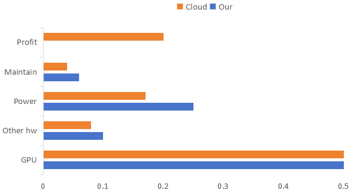

# 李沐 SJTU 讲座总结

简体中文 | [English](README.md)

## 第 1 部分：语言模型

语言模型的构建涉及三大核心要素：算力、数据、算法。李沐老师形象地将机器学习比喻为“老中医”，而将深度学习与语言模型比作“炼丹”：数据是炼丹的材料，算力是丹炉，算法是丹方。深度学习是为特定领域问题优化的工具，而语言模型具有跨领域的广泛适应性。

### 硬件发展趋势

硬件在语言模型的开发中起着至关重要的作用，以下按重要程度递减进行阐述：

1. **带宽**

   * 随着语言模型规模的扩大，分布式训练成为必要。当前每根光纤的速度为 400 Gb，正在向 800 Gb 过渡（Infiniband 以太网）。
   * GB200 72NVL 机型集成了 72 个 GPU，每个 GPU 的速度达到 1.8 TB/s，虽然通过光纤传输数据，但即使是几纳秒的延迟也会在分布式训练中产生性能影响。

2. **内存**

   * 现代模型体积庞大，对内存的需求极高。当前工艺支持每个芯片封装 192GB 内存，但已达到瓶颈。若无技术突破，未来芯片的内存上限可能在 200GB 左右，直接限制了模型的规模。

3. **算力**

   * 随着摩尔定律的推进，处理器的纳米工艺更精细，频率更高。8 位浮点数的成熟应用及 4 位浮点数的引入提升了带宽利用率，使得算力进一步增强。

4. **资源**

   * 更大规模的芯片对供电与散热提出了更高要求。一千块芯片需要一兆瓦的电力支撑，若无有效的散热方案，液体冷却可能成为必需。

5. **替代方案**

   * 市场上其他厂商的芯片如谷歌 TPUv6、英特尔哈瓦那3、AMD Mi350等，虽然在推理方面有所表现，但在训练方面仍难以与 NVIDIA 抗衡。

### 模型的发展

摩尔定律推动了模型规模的增长，训练成本逐年下降，时间缩短。

1. **语言模型**

   * 当前预训练规模在 10-50T tokens，参数量在 100-500B 之间。尽管更大规模的闭源模型可能存在，但它们多以 MoE（稀疏专家）形式存在，实际有效大小仍在 500B 左右。

2. **演讲与语音模型**

   * 端到端模型在情感表达和语调方面表现出色，延迟从 1s 缩短至 300ms，极大提升了人机交互体验。

3. **音乐生成**

   * 技术已经成熟，当前挑战主要集中在版权问题上。大型公司通过购买版权解决问题，小型公司zhijieshang。

4. **图片生成**

   * 分辨率突破 1MP，生成图像的“灵魂感”成为新的挑战。

5. **视频生成**

   * 目前视频生成训练成本高昂，连贯性和一致性仍是关键难题。

6. **多模态模型**

   * 融合文本、图片、音频、视频等多种模式的数据成为趋势，文本信息的泛化能力尤为突出。

### 应用场景

1. **文科白领**

   * 语言模型极大提高了文科白领的工作效率，个人助理、电话客服、文件处理、游戏与娱乐、教育等领域已广泛应用。

2. **工科白领**

   * 虽然尚无法完全取代工科白领的工作，但语言模型已显著减少了工作负担，特别是在软件工程领域。

3. **蓝领**

   * 语言模型在自动驾驶领域表现突出，然而机器人领域因数据匮乏、训练难度高，进展相对缓慢。

|          |    简单任务    |    复杂任务    |
|:--------:|:--------------:|:--------------:|
| 文科白领 |     😄    | 😞 |
| 工科白领 | 😞 | 😭 |
| 蓝领     | 😭 | 😭 |

### 总结与展望

1. **预训练与后训练同等重要**

   * 预训练已由技术问题转变为工程问题，而后训练仍需在技术上深入探索。

2. **垂直领域模型的挑战**

   * 专注于复杂规则遵循、推理与数学计算的领域模型需要具备一般领域的基础技能。

3. **评估至关重要**

   * 模型在实际应用中的复杂性要求精细评估，简单的评估难以准确反映模型性能。

4. **数据的重要性**

   * 数据决定了模型的上限，算法决定了模型的下限。当前研究仍距 AGI 甚远，未来在数据方面的投入将是关键。

5. **算力**

   * 自建 GPU 与租用 GPU 在成本上差异不大，NVIDIA 垄断导致市场算力价格居高不下。

    

### 语言模型的未来

语言模型的发展正逐步突破传统机器学习的界限，面临的挑战与机遇并存。未来的研究将聚焦于如何进一步提升数据质量、优化算法、以及在多模态融合与垂直领域模型中的深度应用。

## 第 2 部分

有关李沐老师在个人发展与职业规划方面的经验分享，请参见以下知乎文章：

- [工作五年反思](https://zhuanlan.zhihu.com/p/374777591)
- [博士这五年](https://zhuanlan.zhihu.com/p/25099638)
- [创业一年，人间三年](https://zhuanlan.zhihu.com/p/714533901)

---

本篇总结若有不妥，欢迎批评指正。